# Claw Arcade — Three.js 컴퓨터 그래픽스 과제 리포트

**정보융합학부 2024404018 이지연**

🎮 **플레이**: https://bborang.github.io/claw-arcade/ <br />
📁 **저장소**: https://github.com/bborang/claw-arcade

---

## 1. 기획 배경

학교를 등교하는 길마다 인형뽑기 가게를 지나치는데, 시간대 가리지 않고 누구나 즐기는 그 익숙한 풍경을 3D로 옮겨보고 싶어서, 인형뽑기 기계 구현을 이번 과제의 주제로 정했다.

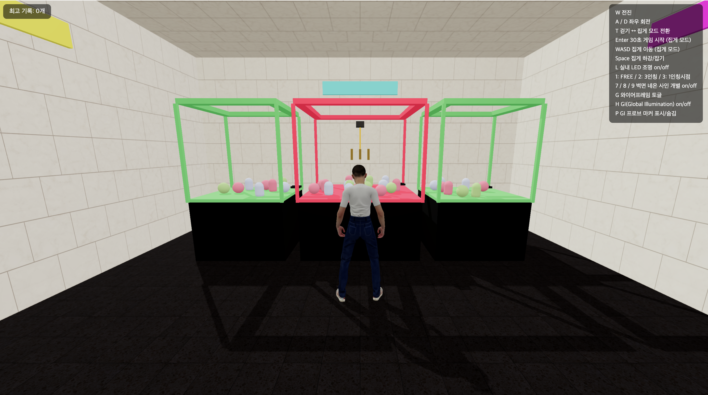

### 설계 의도

이 프로젝트의 목표는 수업에서 다룬 그래픽스 개념(조명/GI, 충돌, 텍스처 매핑, 카메라 제어)을 하나의 공간 안에서 함께 증명하는 것이었다. 기준은 두 가지로, 하나는 **몰입감** — 실제 오락실에 들어가 인형을 뽑는 경험을 최대한 살리는 것. 다른 하나는 **학습 목표와의 연결** — 배운 개념(GI bake, cube map, UV wrapping 등)을 결정 안에 의도적으로 드러내고자 했다. 

게임의 핵심 챌린지 규칙은 다음과 같다. 플레이어는 여러번 시도할 수 있고, 매 시도마다 60% 확률로 성공한다. 100% 성공으로 만들면 인형뽑기 특유의 긴장감이 사라지기 때문에, 확률을 의도적으로 재현해 "운에 맡기는" 경험 자체를 게임의 일부로 설계했다.

### 핵심 설계 결정

| 결정 | 이유 | 상세 |
|---|---|---|
| 컨트롤(W전진, A/D회전) | 좁은 오락실에서 "보는 방향으로만 전진"하는 게 8방향 자유이동보다 의도적이고 재미있음 | 4장 |
| 그립 확률 60% | 100% 성공이면 인형뽑기 특유의 긴장감이 사라짐 — 확률은 의도적으로 재현 | `dollGrab.js` |
| GI를 정적 bake로 단순화 | 18개 프로브 매 프레임 재추적은 비용이 너무 커서, 로드 시 1회 bake로 타협 | 5장 |
| 실내=텍스처wrap, 실외=스카이박스로 분리 | 환경맵(cube map)과 텍스처 반복 모드를 모두 활용하고자 하여 역할을 나눔 | 3-8, 3-9 |


## 2. 조작법

| 키 | 모드 | 동작 |
|---|---|---|
| W | walk | 전진 |
| A / D | walk | 좌/우 회전 |
| WASD | operate | 집게 X/Z 이동 |
| Space | operate | 집게 하강 → 잡기 → 상승 → 배출 시퀀스 |
| T | walk ↔ operate | 모드 전환 (기계 근처일 때만 진입 가능) |
| **Enter** | operate | **30초 챌린지 시작** (6장 참고) |
| 1 / 2 / 3 | walk | 카메라: 자유 / 3인칭 / 1인칭 |
| L | any | 실내 LED on/off |
| 7 / 8 / 9 | any | 벽면 네온 개별 on/off |
| G | any | 와이어프레임(rasterization) 토글 |
| H | any | GI on/off |
| P | any | GI 프로브 마커 표시/숨김 |

우측 상단에 조작키 안내 패널, 한글 입력 시 중앙에 경고 문구가 뜬다.

| 1: 자유(OrbitControls) | 2: 3인칭 | 3: 1인칭 |
|---|---|---|
| 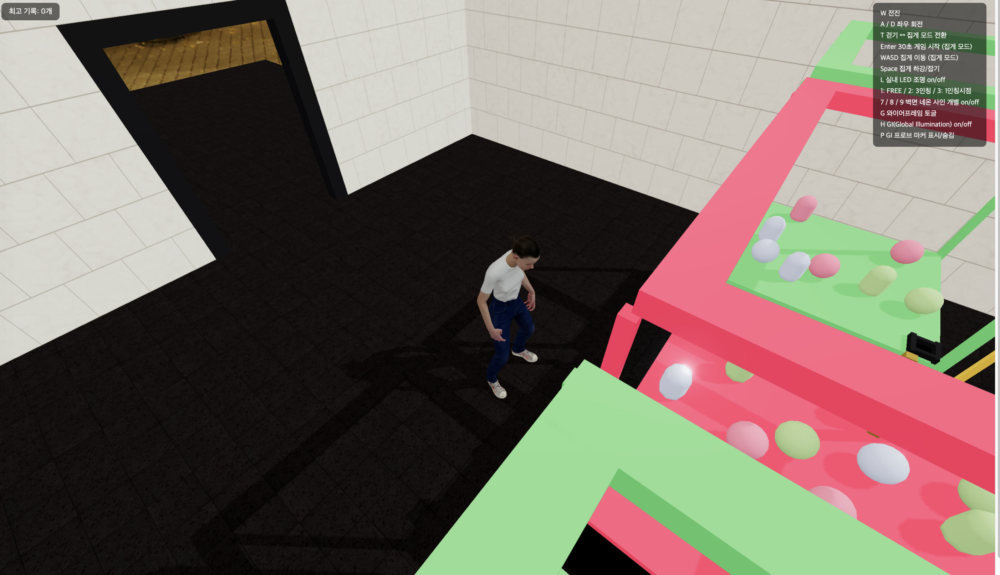 | 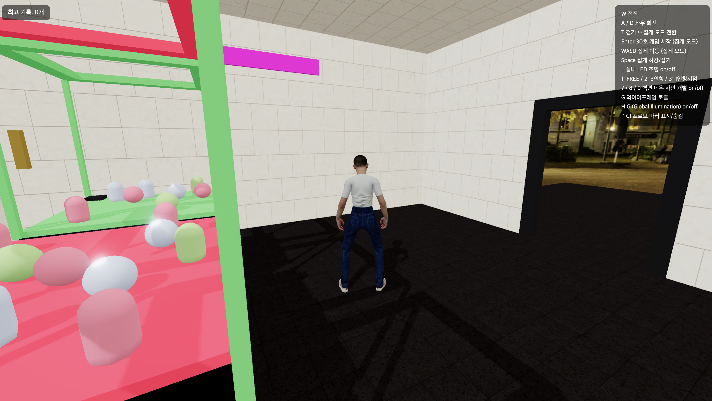 | 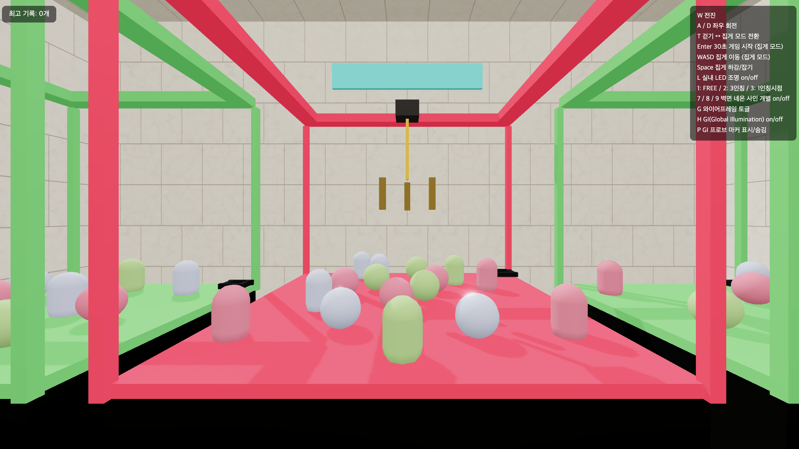 |


## 3. 강의 개념 ↔ 구현 매핑

| 강의 개념 | 구현 | 코드 | 스크린샷 |
|---|---|---|---|
| **Transform** | `claw.attach()`/`scene.attach()`로 부모만 바꿔 월드 좌표 보존하며 인형을 옮김 | `dollGrab.js` | 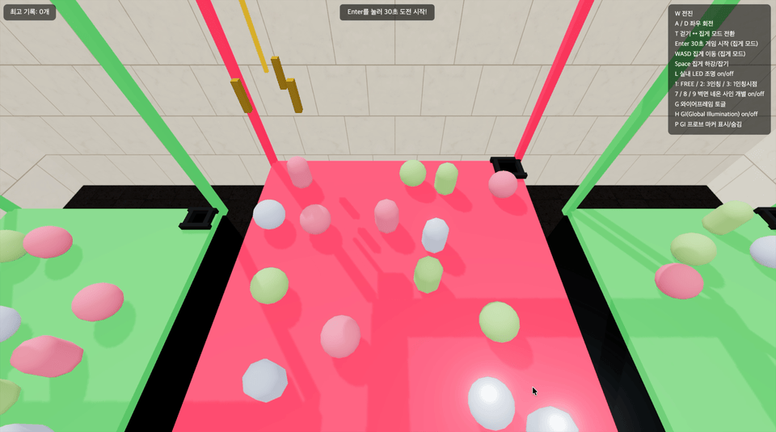 |
| **Rotation** | A/D로 `rotation.y` 직접 증감 (탱크 컨트롤) | `movement.js` | 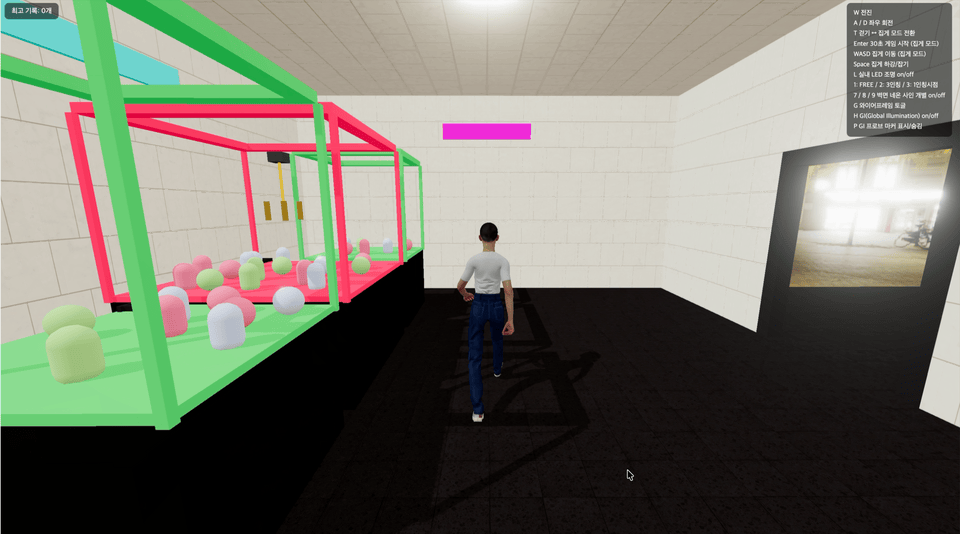 |
| **Skeleton/Animation** | Mixamo FBX + `AnimationMixer`, idle↔walk `crossFadeTo`, 워크 클립은 root motion 제거 후 in-place 재생 (6장 참고) | `loadCharacter.js` | 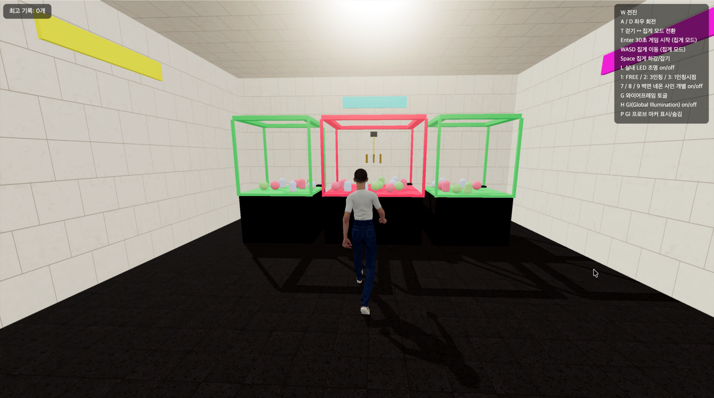 |
| **Lighting** | Hemisphere + Directional(섀도 캐스터) + Point(LED) + RectAreaLight×3(네온) | `setupScene.js`, `buildStore.js` | 7장 비교 표 |
| **Shading** | `MeshStandardMaterial` PBR + `ACESFilmicToneMapping` | `claw.js`, `setupScene.js` | 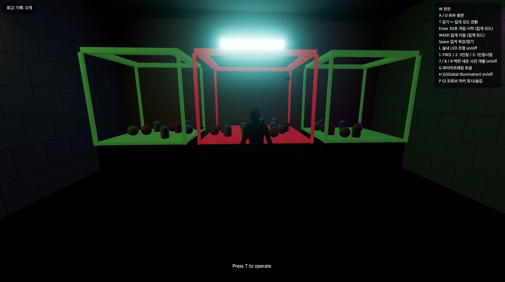 |
| **Graphics Pipeline** | `composer.render()`: vertex transform → rasterize → fragment shading → bloom/tonemap | `postprocessing.js` | 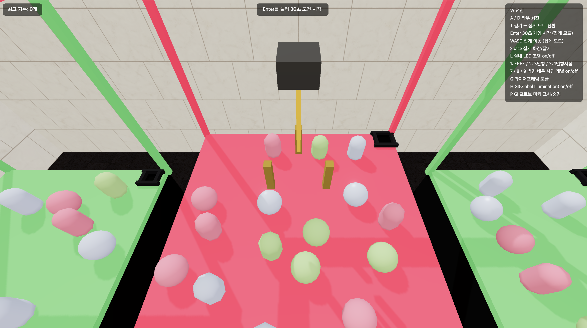 |
| **Rasterization** | G키로 `wireframe` 토글 — 삼각형 단위로 채워지는 과정 확인 | `wireframeToggle.js` | 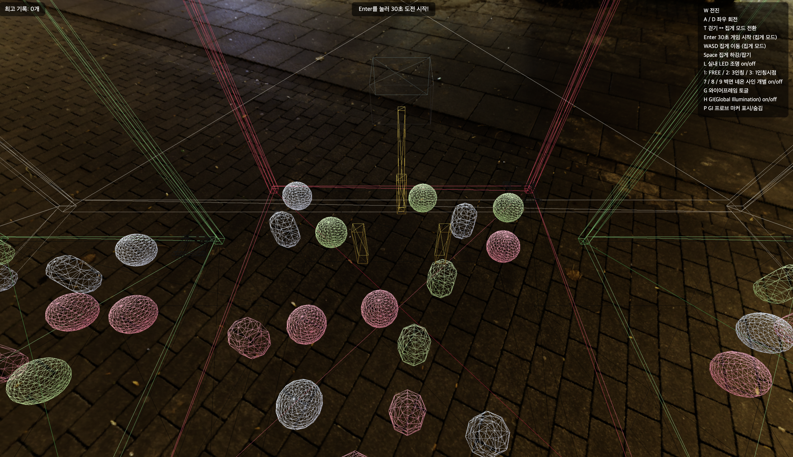 |
| **Texture** | 실내 바닥/벽/천장에 `RepeatWrapping`/`MirroredRepeatWrapping` 적용, 월드 좌표 기반 offset으로 벽 간 경계 정렬 | `textures.js`, `buildStore.js` | 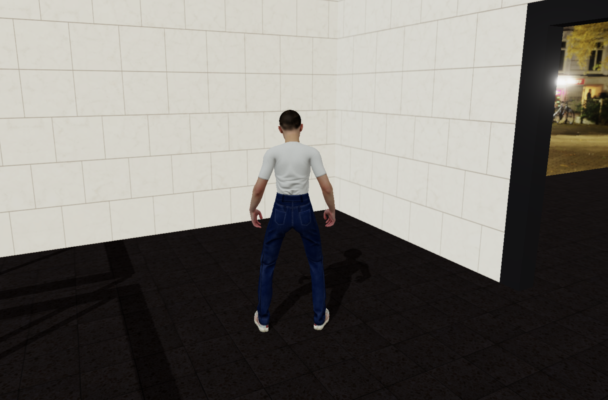 |
| **Environment Map** | 실외는 `CubeTextureLoader` 6면 스카이박스 | `environmentMap.js` | 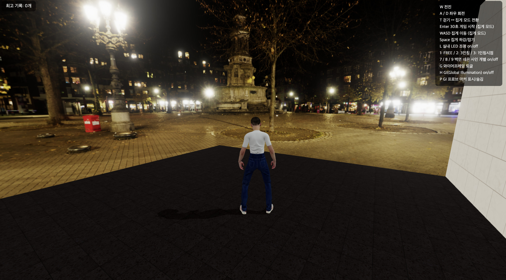 |
| **DDGI (GI)** | `CubeCamera` 18지점 캡처 → SH irradiance → `LightProbe`. 상세는 5장 | `giProbes.js` | 7장 비교 표 |

### 3-1. Transform — 인형 잡기/놓기

집게가 인형을 잡거나 놓을 때 `add()`가 아니라 `attach()`를 써서, 부모만 바뀌고 월드 좌표는 그대로 유지된다.

```js
// dollGrab.js
if (nearest && Math.random() < GRIP_CHANCE) {
  claw.attach(nearest) // attach: 월드 좌표 보존하며 부모만 변경
  nearest.position.set(0, -0.55, 0)
  clawState.attachedDoll = nearest
}
```


### 3-2. Rotation 

A/D는 `rotation.y`를 직접 증감시키고, W는 그 회전값의 `sin/cos`로 전진 방향을 계산한다.

```js
// movement.js
if (keys.a) character.rotation.y += TURN_SPEED * delta
if (keys.d) character.rotation.y -= TURN_SPEED * delta
if (keys.w) {
  character.position.x += Math.sin(character.rotation.y) * SPEED * delta
  character.position.z += Math.cos(character.rotation.y) * SPEED * delta
}
```


### 3-3. Skeleton/Animation — root motion 제거

Mixamo 워크 클립의 Hips 본 XZ를 첫 프레임 값으로 고정해 in-place로 만들고, 원래 클립 속도 대비 실제 이동 속도로 `timeScale`을 다시 계산한다(4장 표 참고).

```js
// loadCharacter.js
function stripRootMotion(clip) {
  const track = clip.tracks.find((t) => /hips/i.test(t.name) && t.name.endsWith('.position'))
  const values = track.values
  const count = values.length / 3
  const startX = values[0], startZ = values[2]
  const endZ = values[(count - 1) * 3 + 2]
  for (let i = 0; i < count; i++) {
    values[i * 3] = startX   // Hips를 첫 프레임 값으로 고정 → 애니메이션이 in-place로 재생
    values[i * 3 + 2] = startZ
  }
  return (Math.abs(endZ - startZ) * MODEL_SCALE) / clip.duration // 원래 클립이 내던 속도(m/s)
}
// walkAction.timeScale = SPEED / naturalWalkSpeed  → 보폭과 실제 이동 속도를 일치
```


### 3-4. Lighting — 직접광 4종

```js
// setupScene.js
const hemiLight = new THREE.HemisphereLight(0xffffff, 0x999999, 1.2)
const directionalLight = new THREE.DirectionalLight(0xffffff, 1.2)
directionalLight.castShadow = true
directionalLight.shadow.mapSize.set(2048, 2048)
```

```js
// buildStore.js — 네온 사인
const rectLight = new THREE.RectAreaLight(s.color, 0, 1.8, 0.3)
rectLight.lookAt(0, 1, 0)
```


### 3-5. Shading — PBR + 톤매핑

```js
// claw.js
const fingerMaterial = new THREE.MeshStandardMaterial({ color: 0xffcf40, metalness: 0.7 })
```

```js
// setupScene.js
renderer.toneMapping = THREE.ACESFilmicToneMapping
renderer.outputColorSpace = THREE.SRGBColorSpace
```


### 3-6. Graphics Pipeline

```js
// postprocessing.js
const composer = new EffectComposer(renderer)
composer.addPass(new RenderPass(scene, camera))
composer.addPass(bloomPass)
composer.addPass(new OutputPass()) // 빠지면 톤매핑이 적용 안 됨
```

```js
// main.js — 매 프레임
composer.render() // vertex transform → rasterize → fragment shading → bloom/tonemap
```


### 3-7. Rasterization — 와이어프레임 토글

```js
// wireframeToggle.js
scene.traverse((obj) => {
  if (!obj.isMesh || !obj.material) return
  obj.material.wireframe = wireframeMode
})
```


### 3-8. Texture — wrap 모드

```js
// textures.js
function loadTexture(path, wrapMode, repeatX, repeatY) {
  const texture = textureLoader.load(`${import.meta.env.BASE_URL}${path}`)
  texture.wrapS = wrapMode
  texture.wrapT = wrapMode
  texture.repeat.set(repeatX, repeatY)
  return texture
}
export const createFloorTexture = (x = 4, y = 4) => loadTexture(FLOOR_PATH, THREE.RepeatWrapping, x, y)
export const createWallTexture  = (x = 4, y = 2) => loadTexture(WALL_PATH, THREE.MirroredRepeatWrapping, x, y)
```


### 3-9. Environment Map — 스카이박스

```js
// environmentMap.js
const loader = new THREE.CubeTextureLoader()
const cubeTexture = loader.load(CUBE_FACES) // +X,-X,+Y,-Y,+Z,-Z 6장
scene.background = cubeTexture
```


### 3-10. DDGI (GI)

```js
// giProbes.js
cubeCamera.position.copy(position)
cubeCamera.update(renderer, scene)
const lightProbe = await LightProbeGenerator.fromCubeRenderTarget(renderer, cubeRenderTarget)
lightProbe.position.copy(position)
lightProbe.intensity = GI_ON_INTENSITY // 1/N로 정규화 (5장 참고)
scene.add(lightProbe)
```

| GI OFF | GI ON |
|---|---|
| 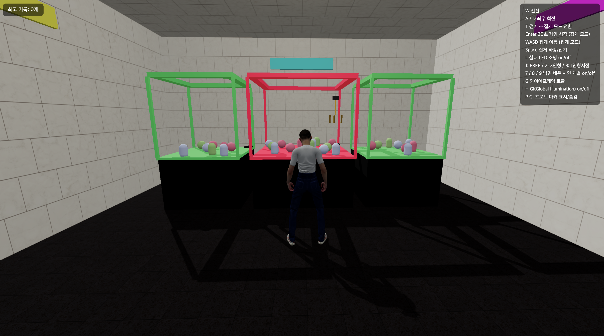 | 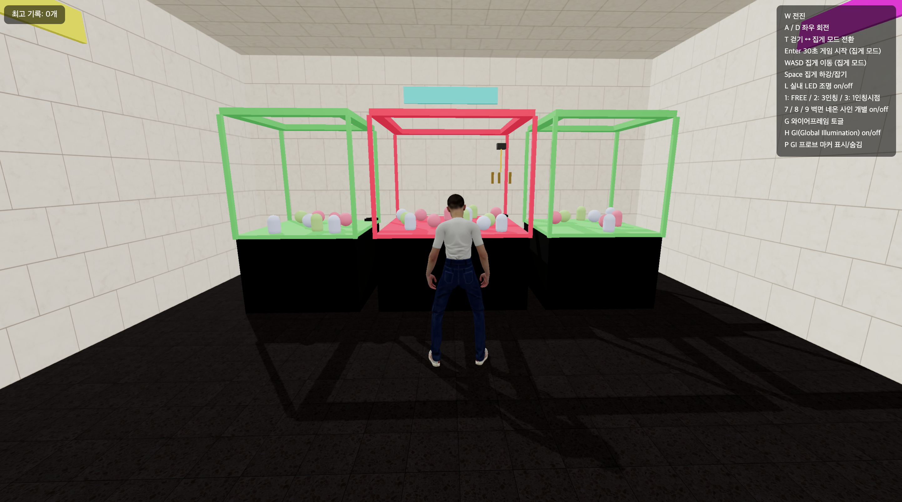 |

### 3-11. 조명 기여도 분해 실험 — 어떤 빛이 뭘 만드는가

H(GI)·L(LED)·7/8번(네온)을 한 단계씩 꺼보면서, 같은 장면·같은 카메라로 7장을 찍어 어떤 광원이 화면에 실제로 얼마나 기여하는지 분해했다.

| 단계 | 상태 | 이미지 |
|---|---|---|
| 1. 기본 | 모든 조명 ON (LED + GI, 네온은 꺼짐) | 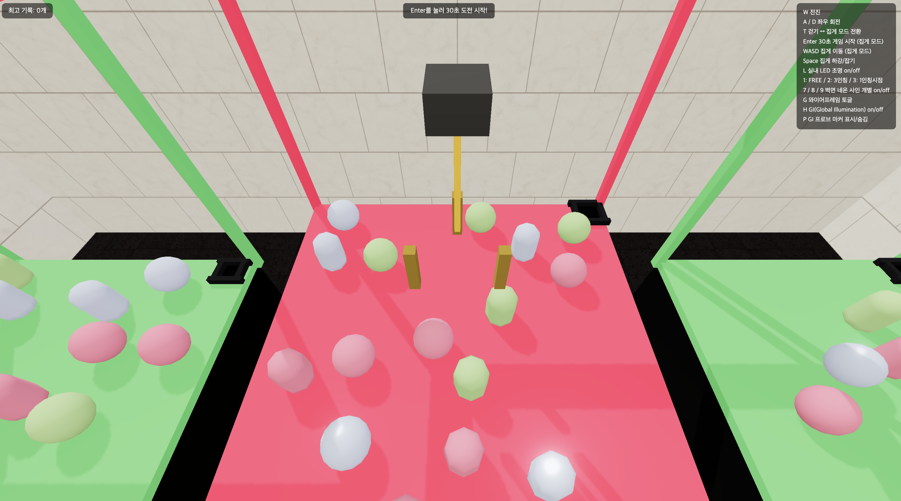 |
| 2. GI OFF | LED는 그대로, GI만 끔 | 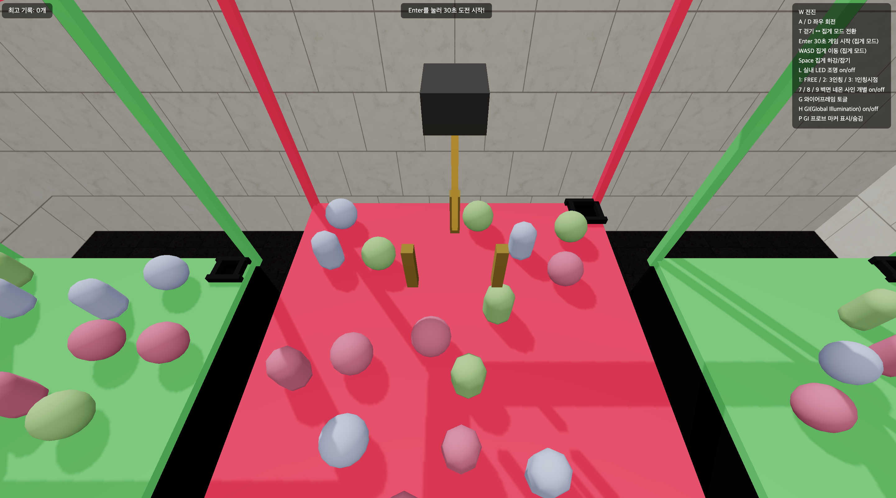 |
| 3. 2 + 네온(7) | 왼쪽 벽 네온 추가 | 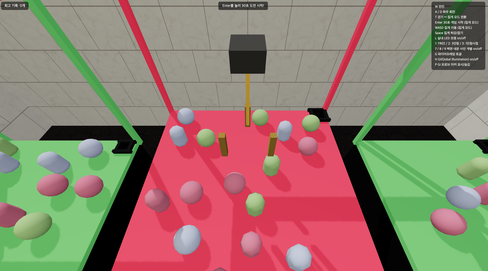 |
| 4. 3 + 네온(8) | 중앙(뒷벽) 네온 추가 |  |
| 5. GI OFF + LED OFF | 메인 광원을 모두 끔 | 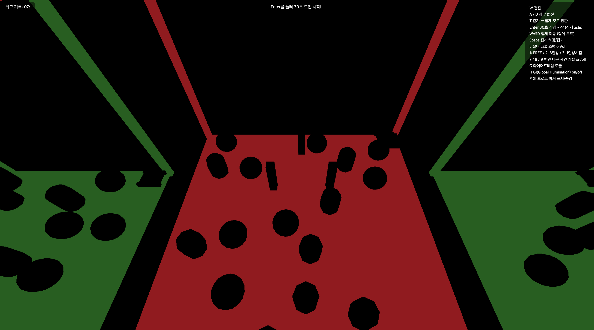 |
| 6. 5 + 네온(7) | 어두운 상태에서 왼쪽 네온만 켬 | 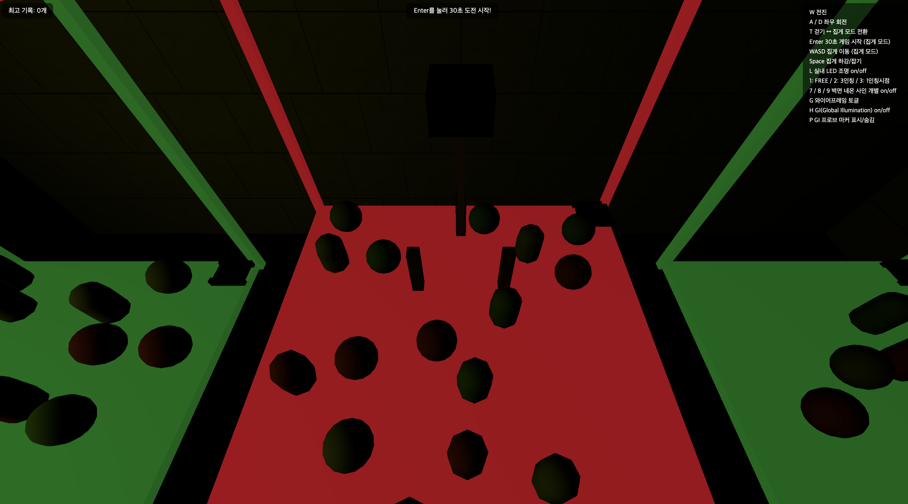 |
| 7. 6 + 네온(8) | 중앙 네온까지 켬 | 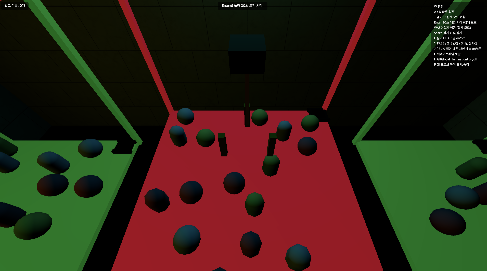 |

**관찰**

- **1→2(GI on→off)**: 화면상 차이가 거의 안 보인다. `DirectionalLight`+`HemisphereLight`(LED)가 워낙 강해서 전역으로 더해지는 GI(`LightProbe`)의 기여가 노출에 묻힌다. GI가 "미세한 보조 간접광"으로는 본래 역할에 맞게 동작하는 것이지만, 동시에 **육안으로 GI 효과를 입증하기엔 기여가 너무 약하다**는 솔직한 한계이기도 하다(8장에 추가).

- **2→3→4(네온 추가, LED 켜진 채로)**: LED가 켜진 상태에서는 네온을 추가해도 거의 안 보인다 — LED 노출이 다른 광원을 가린다.

- **4→5(LED OFF)**: 화면이 거의 완전히 검게 변한다 — **LED(`DirectionalLight`+`HemisphereLight`+`PointLight`)가 이 씬의 메인 광원**이라는 게 명확해진다. 기계 프레임의 옅은 빨강/초록 윤곽만 남는데, 이건 `frameMaterial`의 상시 `emissiveIntensity(0.3)` 때문 — L/H/네온 토글과 무관하게 항상 약하게 빛난다.

- **5→6→7(어두운 상태에서 네온 추가)**: 이제야 네온의 `RectAreaLight` 기여가 또렷이 보인다. 왼쪽 네온(7, 마젠타)을 켜면 그 방향을 향한 인형 표면에 붉은 색조가 입혀지고, 중앙 네온(8, 시안)을 추가하면 다른 방향에 푸른 색조가 더해진다 — **서로 다른 색의 광원이 같은 표면에 각자 다른 방향에서 가산되는 모습**이 가장 잘 드러난다.

| 광원 | 단독 기여가 가장 잘 보이는 조건 | 비고 |
|---|---|---|
| LED (`DirectionalLight`+`HemisphereLight`+`PointLight`) | 항상 — 끄면 방 전체가 거의 암전 | 메인 광원 |
| GI (`LightProbe`, H) | LED를 꺼도 거의 안 보임 | 가장 약한 기여 — 8장 한계점 |
| 네온 (`RectAreaLight`, 7/8/9) | LED OFF 상태에서만 또렷 | LED가 켜져 있으면 묻힘 |
| 기계 프레임 emissive | 모든 조명을 꺼도 항상 옅게 보임 | 광원이 아닌 재질 자체 발광, 토글 불가 |

## 4. 시도와 개선 — A → B 

 가장 많이 바뀐 부분들을 시도 순서대로 정리했다.

| 영역 | A (처음 시도) | 부딫힌 한계 | B (개선) | 이미지 | 
|---|---|---|---|---|
| 벽 텍스처 정렬 | repeat을 정수로 반올림 | 벽마다 실제 타일 크기가 달라져 옆벽과 안 맞음 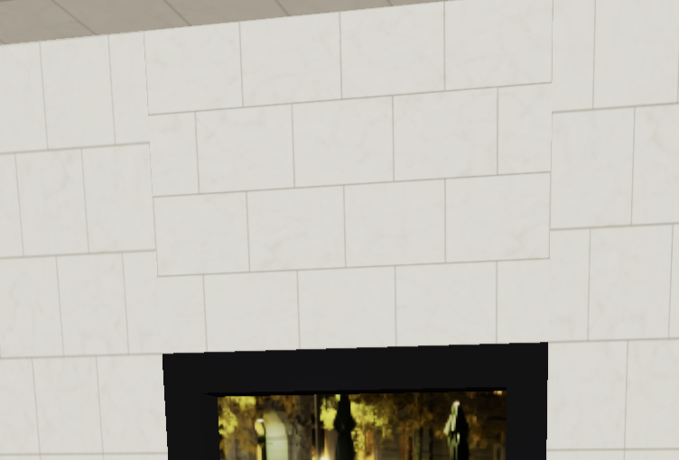| repeat을 `길이/TILE_METERS`로 정확히 고정, 월드 좌표 기반 `texture.offset`으로 벽 간 경계까지 정렬 | 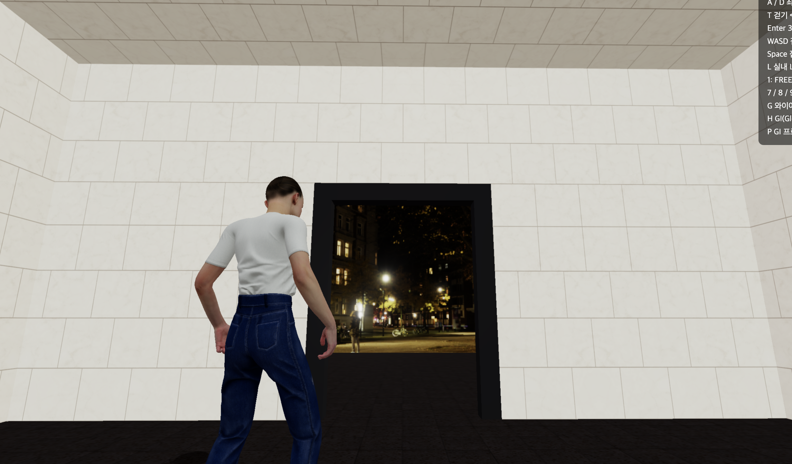 |
| 클로 머신 외형 | 속이 찬 `BoxGeometry` | 안의 집게·인형이 안 보임 | 기둥 4개 + 바닥만 있는 빈 프레임 `Group` | 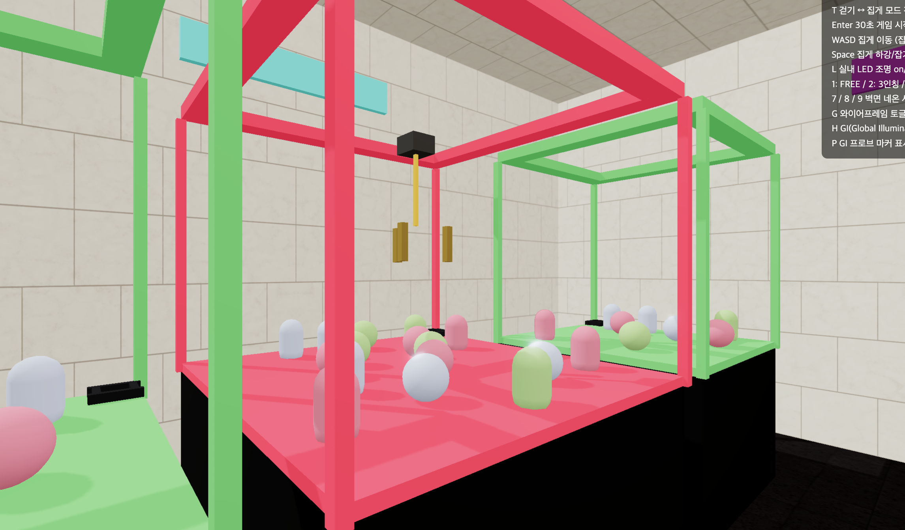 |
| 인형 잡기/놓기 | `scene.add()`로 부모 이동 | 인형이 순간이동(월드 좌표 미보존) | `claw.attach()`/`scene.attach()` |   |
| 집게 손가락 | 2개, 고정 닫힘 반지름 | 손가락이 인형 속으로 파고듦 | 3개로 변경, 닫힘 반지름을 잡은 인형 크기에 맞춰 동적 계산 |  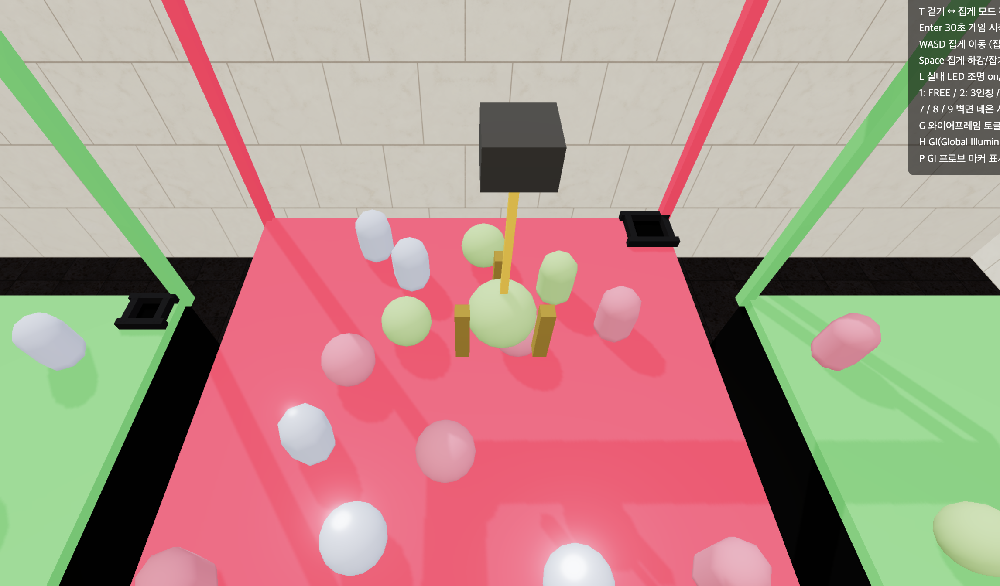 |
| GI 캡처 코드 | `fromCubeRenderTarget()`을 `await` 없이 호출 | Promise 객체를 그대로 써서 캐릭터가 사라지고 H키 먹통 | `async/await` + `try/finally`로 항상 복원 보장 |   |
| GI 밝기 | 프로브 18개를 그대로 더함 | 위치 무관 전역 적용이라 18배 누적되어 과도하게 밝음 | 프로브당 intensity를 `1/N`로 정규화 |   |
| 1인칭 카메라(시야 가림) | 머리 위치로 카메라만 이동 | 캐릭터 몸이 시야를 가림 | 1인칭일 때 `character.visible = false` |   |
| 1인칭 카메라(떨림) | 위치/회전을 매 프레임 그대로 snap | 그림자·블룸으로 프레임 타이밍이 흔들리면 화면이 뚝뚝 끊김 | 위치는 `lerp`, 회전은 `slerp`로 35%씩 보간 |   |
| 걷기 애니메이션 | Mixamo 워크 클립을 그대로 재생 + 코드가 별도로 position 전진 | Hips 본에 baked된 root motion과 중복 이동, 루프마다 다리가 끊김(리셋) 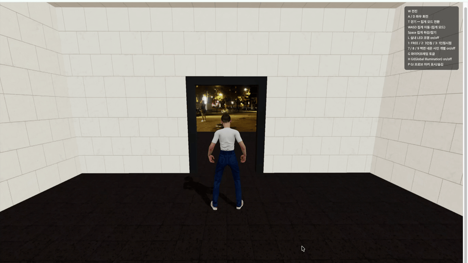| Hips XZ를 첫 프레임 값으로 고정해 in-place로 변경 -> 원래 클립 속도 대비 실제 이동 속도로 `timeScale` 재계산해 보폭 일치 |  |


## 5. GI 구현 상세 (DDGI-lite)

가게 안 18개 지점(3×3 격자 × 2개 높이)에서 `CubeCamera`로 주변을 캡처하고, SH(spherical harmonics) irradiance를 추출해 `LightProbe`로 적용하는 정적 bake 방식이다. 캡처 순간에만 네온을 강제로 켜서 색이 번지는 모습을 구워 넣는다. `H`로 on/off, `P`로 각 프로브가 캡처한 색을 마커 구체로 시각화한다.

### 강의 DDGI 단계와의 대응

| 강의 DDGI 요소 | 본 구현 | 일치/단순화 |
|---|---|---|
| 균일 프로브 격자 | 3×3×2 = 18개 | 일치 |
| 프로브별 주변 캡처 | `CubeCamera` 128×128 큐브맵 | 일치 |
| SH 계수 저장 | `LightProbeGenerator.fromCubeRenderTarget()` | 일치 |
| 인접 프로브 보간 | 없음 — `LightProbe`가 위치 무관 전역 적용 | 단순화 |
| 매 프레임 재캡처 | 페이지 로드 시 1회 정적 bake | 단순화 |

## 6. 게임적 요소 — 30초 챌린지
- **시작**: operate 모드에서 화면 상단에 "Enter를 눌러 30초 도전 시작!" 힌트가 뜨고, Enter로 시작
- **규칙**: 30초 동안 인형을 몇 개든 넣을 수 있고, **5개를 먼저 채워도 타이머는 30초까지 그대로 진행**(조기 종료 없음)
- **판정**: 30초가 끝나는 순간 5개 이상이면 성공, 아니면 실패 — 화면 중앙에 결과 팝업(3초간 표시)
- **최고 기록**: 좌측 상단에 항상 "최고 기록: N개" 표시. `localStorage` 등 영속 저장은 의도적으로 쓰지 않아 새로고침하면 0으로 리셋됨

| 시작 전 | 도전 중 | 결과 |
|---|---|---|
| 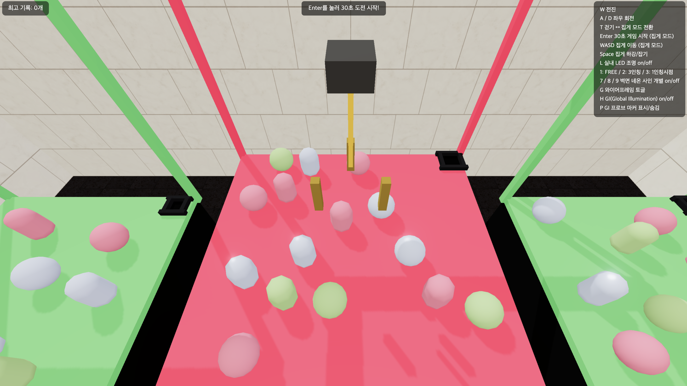 | 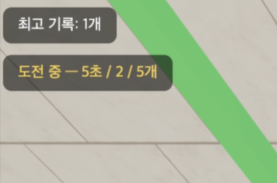 | 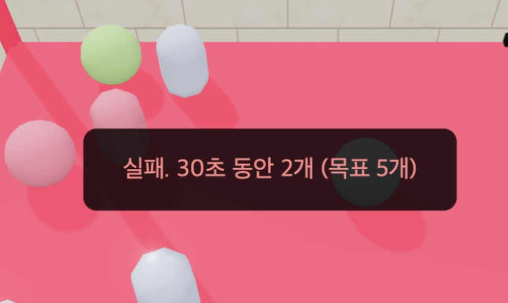 |

## 7. 조명 / GI Before·After

| LED OFF | LED ON |
|---|---|
| 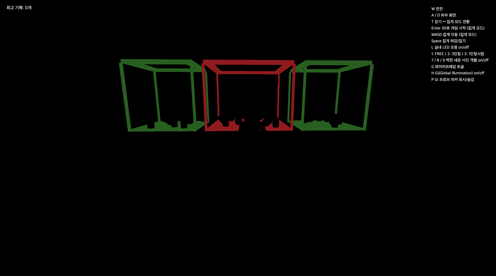 |  |

| GI OFF | GI ON | GI 프로브 마커 |
|---|---|---|
|  |  | 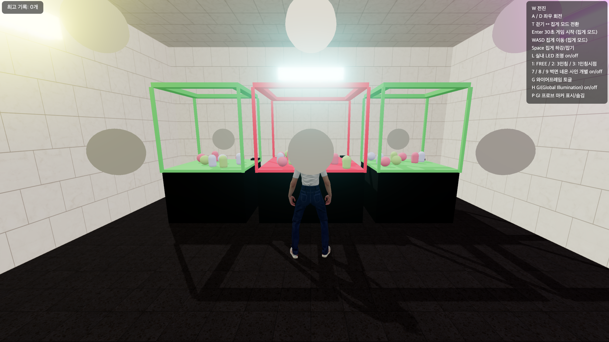 |

## 8. 한계점

단순히 "안 했다"가 아니라, 왜 그 한계가 생겼고 실제로 어떤 영향이 있는지까지 적었다.

| 항목 | 한계 | 원인 | 영향 |
|---|---|---|---|
| GI | 정적 1회 bake, 위치 보간 없는 전역 적용, occlusion(가시성) 테스트 없음 — 5장 대응표 참고. LED가 강해 GI on/off 차이가 육안으로는 거의 안 보임(3-11 실험) | 18개 프로브를 매 프레임 `CubeCamera`로 재추적하면 비용이 너무 커서 페이지 로드 시 1회 정적 bake로 단순화 | 네온/LED 상태가 바뀌어도 GI 색은 다시 안 구워짐. 이론상 빛이 벽 너머로 새는 light leak 가능성(프로브 수가 많아 영향은 제한적) |
| 환경맵 | 스카이박스(근거리 사진 기반)와 3D 바닥 지오메트리가 시각적으로 매칭되지 않음 | 큐브맵은 무한히 먼 배경으로 렌더되는데, 실제 바닥/벽은 유한한 8×8 박스라 지면 연결부에서 이질감이 남음 | 야외에서 둘러보면 "배경 따로, 바닥 따로"인 느낌이 남음. `clampToStore` 경계로 너무 가까이 가는 것만 막아 직접적인 노출은 줄임 |
| 텍스처 | diffuse(컬러)맵만 사용, normal/roughness/AO 등 PBR 풀세트 미적용 | 다운로드한 텍스처 세트 중 컬러맵만 적용 | 가까이서 보면 표면이 평면적으로 보임(요철 음영 없음) |
| 충돌 | 캐릭터-기계는 원형(circle) 콜라이더, 문틀은 박스 콜라이더만 — 메시 단위 정밀 충돌 아님 | 메시/BVH 단위 충돌은 과제 범위를 넘어선다고 판단해 단순 도형 충돌로 한정 | 기계 모서리 등에서 약간의 클리핑(살짝 파고드는 현상)이 있을 수 있음 |
| 물리 | 별도 물리엔진(rapier, cannon-es 등) 없음 — 인형은 쌓이거나 밀리지 않고 고정 위치에서 집게에만 반응 | 인형뽑기 메커닉 자체는 물리 시뮬레이션이 필수가 아니라고 판단해 상태 머신(`clawState.phase`)으로 대체 | 인형끼리 부딫혀도 안 밀려나고, 집게가 인형을 밀어내는 등의 부수적 물리 반응은 없음 |
| 그림자 | `DirectionalLight` 1개만 그림자 캐스터 — `PointLight`(LED), `RectAreaLight`(네온)는 그림자를 만들지 않음 | `RectAreaLight`는 three.js가 그림자를 지원하지 않고, `PointLight` 그림자까지 추가하면 섀도맵 비용이 배로 늚 | 주광원(`DirectionalLight`)을 끄면 네온/LED만 켜진 상태에서는 그림자가 전혀 안 생김 |
| 야외 구역 | 8×8 범위로 한정, 별도 콘텐츠(건물 외관, NPC 등) 없음 | 과제의 핵심은 실내(클로 머신/조명/GI)라 야외는 환경맵 시연용 최소 구성으로 한정 | 야외를 둘러봐도 볼거리가 적음 — 의도적으로 좁게 잡은 전시용 공간 |

## 9. 사용 자료 출처

| 자료 | 용도 | 출처 |
|---|---|---|
| 캐릭터 + 애니메이션(idle / idle-orc / walk) | 플레이어 캐릭터 | [Mixamo](https://www.mixamo.com/#/?page=1&query=megan&type=Character) (Adobe) |
| 스카이박스 | 야외 배경 | [Poly Haven – Hansaplatz](https://polyhaven.com/a/hansaplatz), [HDRI to CubeMap](https://matheowis.github.io/HDRI-to-CubeMap/)으로 변환 |
| 바닥 텍스처 | `floor.jpg` | [ambientCG – Tiles110](https://ambientcg.com/a/Tiles110) (Tiles110) |
| 벽/천장 텍스처 | `celling.jpg` | [ambientCG – Tiles009](https://ambientcg.com/view?id=Tiles009) (Tiles009) |

## 10. 빌드 / 실행

```bash
npm install
npm run dev     # 로컬 개발 서버
npm run build   # 프로덕션 빌드
```